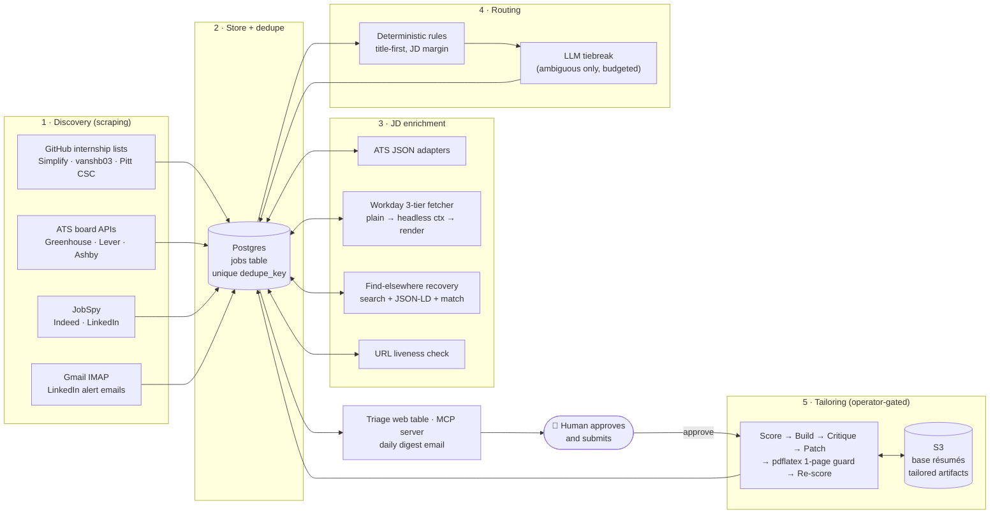
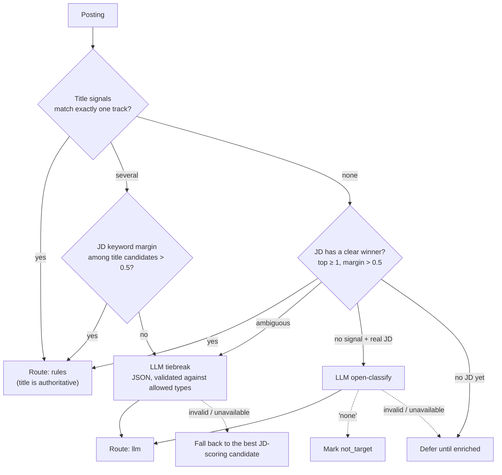

# jobmaxxing

**An end-to-end internship recruiting pipeline. It scrapes job postings from GitHub lists, company ATS boards, job boards and email alerts into one deduplicated feed. Then it routes each posting to the right résumé and tailors a one-page LaTeX résumé for it, with a measured before/after score.**

[](https://github.com/vaibhavw30/jobmaxxing/actions/workflows/ci.yml)
[](https://github.com/vaibhavw30/jobmaxxing/actions/workflows/docker-build.yml)


[](LICENSE)

> 🚧 **In progress: moving to AWS.** The pipeline runs today on GitHub Actions, Supabase Postgres and a nightly job on my laptop. I'm migrating it to AWS right now: ECR images, scheduled Fargate tasks, S3 and Secrets Manager. The plan is [below](#aws-migration-in-progress).

---

## What it does

Internship recruiting is a high-volume funnel with two slow, mechanical steps: **finding** relevant postings before they fill up, and **tailoring** a résumé well for each one. jobmaxxing automates both, up to the point where a person needs to decide.

1. **Scrape and aggregate.** Pollers pull postings from curated GitHub internship lists, company ATS boards (Greenhouse, Lever, Ashby), job boards (Indeed and LinkedIn via JobSpy) and LinkedIn alert emails. Everything lands in one Postgres table, deduplicated across sources.
2. **Enrich.** Postings that arrive as a bare link get their full job description (JD) fetched. That includes Cloudflare-protected Workday sites and, as a last resort, wherever else the same posting appears on the web.
3. **Route.** Each posting is classified into one of 8 résumé tracks (`swe`, `mle`, `ai`, `quant-dev`, `quant-trader`, `fdse`, `robotics`, `av`). Deterministic rules handle most of them. An LLM is called only for the ambiguous cases, and its answer is checked against a schema.
4. **Tailor.** For a job I approve, a two-pass LLM loop rewrites that track's base LaTeX résumé against the JD. A second pass critiques it adversarially. The result is compiled with `pdflatex` and held to one page, which is measured from the PDF rather than taken from the model. The output is scored on a 5-axis rubric before and after, so every tailored résumé comes with a number showing whether it improved.
5. **Review and apply.** I triage jobs in a local web table or by chatting with Claude Code over an MCP server. **Nothing is ever submitted automatically.** A person approves every application.

## At a glance

| | |
|---|---|
| **Language / runtime** | Python 3.12, `uv`, `hatchling` |
| **Data** | PostgreSQL (Supabase) with 11 SQL migrations and funnel views; S3 for résumé artifacts |
| **LLMs** | Provider-agnostic layer over Anthropic, OpenAI, xAI and the local `claude` CLI, with per-task model tiers, ordered fallback and prompt caching |
| **Scraping** | `httpx` JSON APIs, Playwright headless Chromium (Workday / Cloudflare), JobSpy, IMAP, JSON-LD extraction |
| **Infra** | Docker (multi-stage, non-root), GitHub Actions (5 workflows: CI, image build, pollers every 3h, LLM routing, daily digest), macOS `launchd`, migrating to **AWS (ECR, Fargate, S3, Secrets Manager)** |
| **Interfaces** | MCP server (11 tools) for Claude Code, a Flask triage table, an SMTP digest email |
| **Quality** | **621 tests** (~7.2k LOC) against ~5k LOC of source. DB tests run on a real Postgres via `pytest-postgresql`; live end-to-end tests are opt-in |
| **Process** | 27 design specs and 22 implementation plans in [`docs/superpowers/`](docs/superpowers/), built test-first |

---

## Architecture



Each job moves through a single `status` column. That column is the only orchestration the pipeline needs: no queue, no broker.

```
new → routed → approved_for_tailoring → tailored → reviewed → applied | rejected
                     ▲                                          ▲
                human gate                                  human gate
```

---

## How it works

### 1. Discovery: scraping without getting banned

| Source | How | Where it runs | Why there |
|---|---|---|---|
| Curated GitHub lists (Simplify, vanshb03, Pitt CSC) | Structured `listings.json` | GitHub Actions, every 3h | Free, reliable, and the maintainers want it read |
| Company ATS boards ([watch-list](config/watchlist.yaml)) | Public Greenhouse / Lever / Ashby JSON APIs, full JDs included | GitHub Actions, every 3h | Stable, and full JDs make routing and tailoring accurate |
| Indeed, LinkedIn | [JobSpy](https://github.com/speedyapply/JobSpy), search terms seeded from the 8 tracks | Local, nightly | Job boards return 429 to datacenter IPs |
| LinkedIn saved-search alerts | Gmail over IMAP (app password) with a pure `.eml` parser | Local, nightly | The credential stays off CI, and there's no logged-in LinkedIn scraping |

**Sources are isolated.** Every poller wraps its whole body, logs, and keeps going, so one broken source never fails the run. The GitHub lists and ATS APIs are the reliable core. Everything else adds coverage, and the pipeline stays useful if those sources break.

### 2. Storage and deduplication

- **Idempotent by construction.** A `unique (dedupe_key)` constraint on normalized `company | title` lets every poller upsert blindly. Re-running any stage can't create duplicates.
- **Merges enrich, never destroy.** When the same job arrives from a richer source, [`merge.py`](src/jobmaxxing/merge.py) upgrades the row (for example, a link-only LinkedIn alert gains a full ATS JD) and folds the extra URLs into `alt_urls`. No URL is ever dropped.
- **Date-aware term windows.** Postings are tagged with their term (for example `Summer 2027`). The "upcoming terms" window moves forward with the calendar, so there's no hand-maintained list to keep up to date.
- **Writes are batched** into one pipelined `executemany` per transaction. That turns thousands of round trips to the remote database into a single commit.

### 3. JD enrichment: getting the real description

Routing and tailoring need JD text, but many sources only give a link.

- **Clean-API adapters** turn a posting URL into its ATS JSON endpoint (Greenhouse, Lever, Ashby, SmartRecruiters).
- **Workday** sits behind Cloudflare, so [`enrichment/workday.py`](src/jobmaxxing/enrichment/workday.py) escalates through three tiers: a plain `cxs` JSON call, then a headless browser context that clears the challenge, then a full render that intercepts the careers app's own XHR. Failures fall into three classes (*blocked*, *gone*, *transient*), and each class is retried differently. A Workday tenant that makes zero progress in a run goes on a **1-hour cooldown**, so blocked tenants don't eat the batch.
- **Find-elsewhere recovery** ([`recovery/`](src/jobmaxxing/recovery/)) searches the web for the same posting and reads `JobPosting` JSON-LD from aggregators and company sites. A candidate is accepted **only** on a whole-token req-id or back-link match, or on a fuzzy company+title match that an LLM also confirms. The design prefers a safe miss to a wrong JD.
- **URL verification** re-checks the links of jobs in the current window. When a link is dead (404/410), it looks for a working replacement and promotes it. If none turns up, the row is marked dead.

### 4. Routing: a router, not a ranker

Routing picks which base résumé to use. It is deliberately **not** a semantic relevance model.



- **Matching** uses word-boundary regexes, so `ai` doesn't match inside "tr**ai**ning" while `c++` still matches. JD hits are **capped** so keyword-stuffed JDs can't dominate. **Exclusion signals** actively disqualify a track (for example "LLM" pushes a posting from `mle` toward `ai`).
- **LLM spend is bounded three ways.** There's a per-run call budget. Title-only classification has a separate budget. And the schedule is split: `route --no-llm` runs every 3h, so rule-matched jobs show up within hours, while the full LLM pass runs every ~4 days over the ambiguous backlog. Every run logs its `rules / llm / deferred` split, and [`config/routing.yaml`](config/routing.yaml) can be tuned to push the LLM share down.
- **Manual overrides win.** `route_method='manual'` rows are never overwritten by automated routing.

### 5. Tailoring: measured improvement, not vibes

[`tailoring/tailor.py`](src/jobmaxxing/tailoring/tailor.py) runs this loop for one approved job:

| Pass | What happens | Deterministic? |
|---|---|---|
| **0 · Score (before)** | 5-axis rubric score of the base résumé against this JD | Keyword axis: yes |
| **1 · Build** | LLM makes surgical edits to the base `.tex`: one page, **no fabrication**, template preserved. The base résumé is prompt-cached. | — |
| **2 · Critique + patch** | Adversarial review from two personas: a *senior engineer* (the 3 biggest weaknesses) and a *hiring manager / ATS* (missing keywords). Then the fixes are applied. | — |
| **3 · Compile + one-page guard** | `pdflatex`, then **the page count is measured from the PDF** with `pypdf`. On overflow: shrink and recompile, up to 3 times. | Yes |
| **4 · Score (after)** | The *identical* scorer runs again, and the delta is recorded | Keyword axis: yes |

**The 5-axis rubric** ([`tailoring/scorer.py`](src/jobmaxxing/tailoring/scorer.py), [`rubrics/`](rubrics/)):

1. **Keyword coverage** is computed in code, not by the LLM. It's alias-aware and boundary-matched, and reported two ways: *static* against the track's dictionary ("does this read like an MLE?") and *dynamic* against terms from this specific JD ("will it pass this company's ATS filter?").
2. **Technical depth**, 3. **Impact quantification**, 4. **ATS parseability**, 5. **Relevance ordering** are graded by an LLM at `temperature=0` for a reproducible delta. The LLM gets the same rubric terms, so its grades are anchored to the deterministic axis. If the output doesn't parse, the axes fall back to a neutral 5.0 instead of crashing the run.

The composite uses **weights that differ by track**. For example, `mle` weights depth and impact at 0.3 each, while `swe` puts more weight on keyword coverage and ATS parseability. Each job writes `tailored.tex`, `tailored.pdf`, `review.json` (scores, delta, weaknesses, missing keywords) and `diff.txt` to `s3://…/tailored/{job_id}/`, so I review exactly what changed before using it.

> Validated end to end with real `pdflatex` on a real résumé: 3 of 3 runs produced a compiling one-page PDF with a reproducible composite delta of about **+2.7**.

### 6. Provider-agnostic LLM layer

Every LLM call goes through a single function, [`llm.complete(task, messages, …)`](src/jobmaxxing/llm/client.py). No other code imports a vendor SDK.

```yaml
# config/llm.yaml: each task maps to an ordered list of (provider, model) candidates
route:  [anthropic/claude-haiku-4-5, openai/gpt-4o-mini, xai/grok-3-mini]   # cheap, high-frequency
tailor: [claude-cli/sonnet, anthropic/claude-sonnet-4-5, openai/gpt-4o]     # quality
score:  [anthropic/claude-sonnet-4-5, claude-cli/sonnet, openai/gpt-4o]     # API first: honors temperature=0
```

- Providers with no API key are skipped. Transient errors **fall through** to the next candidate, while configuration errors surface immediately. Switching models is a config change.
- **Prompt caching** (Anthropic `cache_control`) is applied to the base résumé, the one payload that repeats on every tailoring call.
- **The `claude-cli` provider** sends tailoring to the local `claude -p` on a flat-rate subscription instead of paid API tokens. It removes API-billing credentials from the child process's environment, and it runs the CLI with a strict one-tool **allowlist**, so a prompt injection hidden in scraped JD text can't run shell commands on my machine.

### 7. Interfaces

- **MCP server** ([`mcp/server.py`](src/jobmaxxing/mcp/server.py)): I drive the pipeline conversationally from Claude Code, for example `query_jobs(status="routed")` → `approve(id)` → `tailor_job(id)` → `get_review(id)` → `set_status(id, "applied")`, plus tools for the manual JD queue and overrides.
- **Local triage table** ([`web/`](src/jobmaxxing/web/)): Flask, bound to `127.0.0.1`, JSON-only POSTs with a Host-header allowlist. Marking a job *Interested* queues it for tailoring.
- **Daily digest email** from GitHub Actions: new roles in window, the undecided backlog, and the manual-capture queue.

---

## Engineering decisions

The guiding principle: **the reliable core is cheap, structured and boring; everything fancy is additive and fails soft.**

- **Deterministic guards around every model output.** Page count, keyword coverage, route validity and JD matching are all checked in code. The model never grades its own homework unchecked.
- **Cost as a design constraint.** The whole season is budgeted in LLM credits. Discovery and routing are free or nearly free, and the expensive step (tailoring) runs only on jobs I approve. It never runs on the whole feed.
- **Every boundary is injected.** The tailoring loop takes `store`, `complete` and `compile_fn` as parameters, so the full five-pass loop runs in unit tests without S3, an LLM or TeX.
- **Things I deliberately didn't build:** a message broker or Celery (a cron job plus a status column is enough at this volume); embeddings or pgvector (routing is a classifier with 8 labels, not a search problem); a logged-in LinkedIn scraper (the ban risk isn't worth it); and auto-submit (the human gate is a hard architectural boundary).
- **Security on a public repo.** Secrets are only injected at runtime. The pollers workflow never runs on fork PRs. The image runs as non-root with nothing baked in. The web UI is bound to localhost only.

## Testing

```bash
uv run pytest            # 621 tests; DB tests need a local Postgres server on PATH
```

- **Real database, not mocks.** Store, pipeline and routing tests run against a throwaway PostgreSQL instance (`pytest-postgresql`), so SQL, constraints and migrations are actually exercised.
- **Recorded fixtures** for Simplify, Greenhouse, Lever and Ashby payloads, plus a scrubbed LinkedIn alert `.eml`.
- **Live end-to-end tests** (Workday, JD recovery, JobSpy, the `claude` CLI) are opt-in with `JOBMAXXING_E2E=1`, so CI stays deterministic.
- **CI** runs the suite on every push, and a separate workflow builds the Docker image and checks inside the container that configs and migrations resolve.

---

## AWS migration (in progress)

**Status: actively working on it.** The groundwork is done: the Docker image is built and checked in CI, all config comes from environment variables, compute is stateless, and S3 access already uses boto3's default credential chain, so it works with IAM roles. The move is mostly infrastructure. The current design ([spec](docs/superpowers/specs/2026-06-16-dockerfile-aws-portability-design.md), [tech plan](docs/TECHNICAL_IMPLEMENTATION_PLAN.md#2-stack-decisions-and-why-each-is-the-cheapboring-choice)) expects **no application code changes**.

| Concern | Today | On AWS |
|---|---|---|
| Container registry | Built in CI only | **Amazon ECR** |
| Pollers, routing, digest (`run`, `route`, `report`, …) | GitHub Actions cron | **Scheduled ECS Fargate tasks**, the same `python -m jobmaxxing.<stage>` per task |
| Short stages (e.g. `route`) | GitHub Actions | Optionally **Lambda** from the same container image |
| Tailoring (`pdflatex`) | Local, operator-run | **Lambda container image or a small Fargate task with TeX Live**, pay-per-invocation and only for approved jobs |
| Secrets (`DATABASE_URL`, LLM keys) | GitHub Actions secrets / `.env` | **Secrets Manager / Parameter Store**, injected into the task definition |
| Base résumés + tailored artifacts | S3 (optionally a local folder) | **S3** with an IAM task role instead of access keys |
| Database | Supabase Postgres | Supabase Postgres (unchanged for now) |

Roadmap:

- [x] Multi-stage, non-root Docker image for the core stages, with CI build and an in-container config check
- [x] Environment-only config, stateless stages, boto3 default credential chain
- [ ] Push the image to ECR from CI
- [ ] Fargate task definitions per stage, secrets from Secrets Manager, IAM task role for S3
- [ ] Scheduled tasks replace the GitHub Actions pollers
- [ ] Separate TeX Live image so tailoring runs in the cloud on demand

---

## Project status

| Phase | State |
|---|---|
| 1 · Core feed (GitHub lists + ATS → deduped Postgres) | ✅ Live, every 3h |
| 2 · Routing (rules + budgeted LLM tiebreak, 8 tracks) | ✅ Live |
| 3 · Tailoring (two-pass loop, 5-axis scorer, one-page guard) | ✅ Validated end to end |
| 4 · Interfaces (MCP server, triage table, digest email) | ✅ Live |
| 5 · Broader discovery + enrichment (JobSpy, Gmail, Workday, recovery, URL checks, nightly scheduler) | ✅ Built and merged |
| ☁️ AWS migration | 🚧 In progress |
| 6 · Human-gated form-fill assist | 🔲 Not yet designed |

The detailed status is in [`docs/ROADMAP.md`](docs/ROADMAP.md).

## Quickstart

```bash
git clone https://github.com/vaibhavw30/jobmaxxing && cd jobmaxxing
cp .env.example .env                        # set DATABASE_URL (any Postgres)
uv sync
uv run python -m jobmaxxing.migrate         # apply the 11 migrations
uv run python -m jobmaxxing.run             # scrape the lists + ATS boards
uv run python -m jobmaxxing.route --no-llm  # route with rules only (no API keys needed)
uv run --extra web python -m jobmaxxing.web # triage at http://127.0.0.1:8765
```

Or with Docker: `docker build -t jobmaxxing . && docker run --rm -e DATABASE_URL=… jobmaxxing -m jobmaxxing.run`.

The setup and runbook for every stage (tailoring, MCP, Workday, JobSpy, Gmail, the nightly scheduler, SMTP) is in **[`docs/OPERATIONS.md`](docs/OPERATIONS.md)**.

## Repository layout

```
src/jobmaxxing/
├── sources/        GitHub-list + ATS pollers (pure parsers)
├── discovery/      JobSpy + Gmail/IMAP LinkedIn-alert ingestion
├── enrichment/     ATS JD adapters + tiered Workday/Playwright fetcher
├── recovery/       find-elsewhere: web search → JSON-LD extract → match
├── verification/   URL liveness + dead-link replacement
├── routing/        rules, LLM tiebreaker, open-classify, budgets
├── tailoring/      passes, 5-axis scorer, LaTeX compile + one-page guard, S3/local store
├── llm/            provider-agnostic client, providers (incl. claude-cli), caching
├── mcp/            MCP server exposing the pipeline as tools
├── web/            localhost Flask triage table
├── scheduling/     nightly local-worker orchestrator (launchd)
├── store.py · merge.py · normalize.py · pipeline.py   dedupe, merge, upsert core
config/             routing signals, LLM tiers, watch-list, JobSpy searches
rubrics/            per-track keyword dictionaries, aliases, axis weights
migrations/         11 ordered SQL migrations (schema, funnel views, queues)
docs/               PRD, technical plan, roadmap, operations, 27 feature specs
```

## Documentation

- [`docs/PRD.md`](docs/PRD.md): the problem, goals, non-goals and success metrics
- [`docs/TECHNICAL_IMPLEMENTATION_PLAN.md`](docs/TECHNICAL_IMPLEMENTATION_PLAN.md): architecture, data model, rubric system, budget model
- [`docs/ROADMAP.md`](docs/ROADMAP.md): what's shipped and what's next
- [`docs/OPERATIONS.md`](docs/OPERATIONS.md): how to run everything
- [`docs/superpowers/specs/`](docs/superpowers/specs/) and [`plans/`](docs/superpowers/plans/): one design spec and implementation plan per feature. Each feature went spec → plan → test-driven implementation → review.

## License

[MIT](LICENSE)
